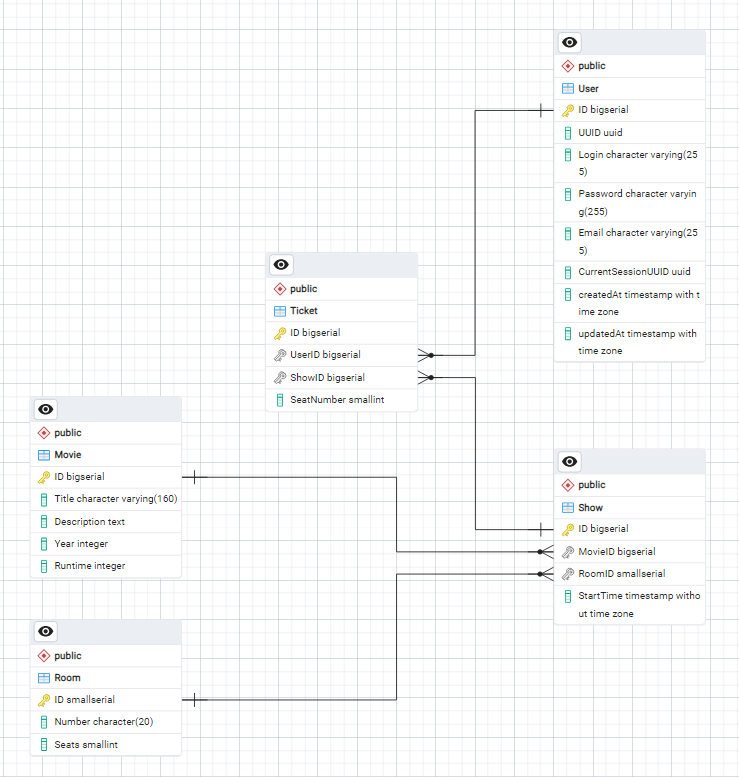

# Aplikacja - rezerwacja biletów w kinie

## Skład grupy

- Marcin Walendzik
- Szymon Miękina
- Ignacy Siklucki

## Technologie

Baza danych: Postgres

Frontend: Handlebars

Backend: Node.js

ORM: Sequelize

## Główne operacje

- rezerwacja biletu, wybór fotela, "zapłata"
- rezygnacja z rezerwacji
- wyświetlenie rezerwacji
- wyświetlenie repertuaru

## Repozytorium

[Link](https://github.com/szym-mie/cinema-tickets-project)

## Spis treści

* [Skład grupy](#skład-grupy)
* [Technologie](#technologie)
* [Główne operacje](#główne-operacje)
* [Repozytorium](#repozytorium)
* [Spis treści](#spis-treści)
* [Schemat](#schemat)
* [Tabele](#tabele)
    * [Movie](#movie)
    * [Show](#show)
    * [Room](#room)
    * [Ticket](#ticket)
    * [Payment](#payment)
    * [User](#user)
    * [Log](#log)
* [Relacje](#relacje)
* [Operacje](#operacje)
    * [Login](#login)
    * [SignUp](#signup)
    * [Logout](#logout)
    * [BookShow](#bookshow)
    * [RebookShow](#rebookshow)
    * [RefusePayment/UnbookShow](#refusepayment)
    * [FinishPayment](#finishpayment)
* [Technologie](#technologie)
## Schemat

## Tabele

### Movie
Filmy

|kolumna|typ|opis|
|:-|:-:|:-|
|id|bigint|klucz główny|
|title|string|tytuł filmu|
|description|text|opis filmu|
|year|int|rok premiery filmu|
|runtime|int|długość filmu w minutach|

### Show
Seanse

|kolumna|typ|opis|
|:-|:-:|:-|
|id|bigint|klucz główny|
|movieId|bigint|ID filmu|
|roomId|bigint|ID sali kinowej|
|price|decimal|cena jednego biletu|
|date|dateonly|data odbycia się seansu|
|time|time|godzina rozpoczęcia seansu|

### Room
Sale kinowe

|kolumna|typ|opis|
|:-|:-:|:-|
|id|bigint|klucz główny|
|number|string|numer sali kinowej|
|seats|smallint|numer foteli w sali|

### Ticket
Bilety

|kolumna|typ|opis|
|:-|:-:|:-|
|id|bigint|klucz główny|
|token|string|unikatowy token biletu|
|userId|bigint|ID użytkownika|
|showId|bigint|ID zarezerwowanego seansu|
|paymentId|bigint|ID płatności|
|seatNumber|smallint|numer zarezerwowanego fotela|

### Payment
Płatności

|kolumna|typ|opis|
|:-|:-:|:-|
|id|bigint|klucz główny|
|userId|bigint|ID użytkownika|
|token|string|token płatności|
|issueTime|date|data i czas płatności|
|isPaid|bool|status opłacenia płatności|

### User
Użytkownicy (klienci)

|kolumna|typ|opis|
|:-|:-:|:-|
|id|bigint|klucz główny|
|login|string|nazwa użytkownika|
|password|string|zhaszowane hasło użytkownika|
|email|string|email użytkownika|
|currentSession|string|token aktywnej sesji|

### Log
Logi (dziennik)

|kolumna|typ|opis|
|:-|:-:|:-|
|id|bigint|klucz główny|
|type|string|typ logu: INFO lub ERROR|
|message|text|zawartość wiadomości logu|
|eventTime|date|data i czas zdarzenia|
|about|string|tytuł logu (nazwa dotyczącej tabeli)|

## Relacje

|tabela 1|relacja|tabela 2|klucz|
|:-|:-:|:-|:-|
|Movie|1:n|Show|movieId|
|Room|1:n|Show|roomId|
|Payment|1:n|Ticket|paymentId|
|Show|1:n|Ticket|showId|
|User|1:n|Ticket|userId|

## Operacje

Każda operacja oprócz właściwej modyfikacji danych, przesyła również informacje do tabeli *Logs* o statusie wykonania.

### SignUp

Zarejestruj użytkownika w bazie danych - utwórz konto, z unikalnym loginem, emailem i hasłem.
Ustawiona jest walidacja na długość loginu (> 4 litery alfabetu łacińskiego w tym cyfry i wybrane znaki specjalne), walidacja adresu email.

#### CRUD:
1. create User

### Login

Zaloguj użytkownika, wydajac przy tym token sesji.

#### CRUD:
1. find (select) User by login, password
2. update User.currentSession = new_token

### Logout

Wyloguj użytkownika usuwając token sesji.

#### CRUD:
1. udpate User.currentSession = NULL

### BookShow

Zarezerwuj miejsca na sali kinowej na dany seans. Kupujący otrzymuje Payment, który może zapłacić, lub odmówić (rezygnacja z rezerwacji).

#### CRUD:
1. create Payment
2. create Ticket for each seat taken
3. commit transaction

### RebookShow

Jeżeli klient nie dokonał płatności, może zmienić zarezerwowane fotele.

#### CRUD:
1. delete previous Tickets of selected payment
2. create Ticket for each seat taken
3. commit transaction

### RefusePayment/UnbookShow

Klient odmawia płatności, rezygnując z rezerwacji.

#### CRUD:
1. delete Tickets of selected payment
2. delete Payment
3. commit transaction

### FinishPayment

Klient zapłaca za zarezerwowane miejsca, otrzymując dostęp do biletów.

#### CRUD:
1. update Payment.isPaid = true

## Technologia

### Sequelize

Jest to ORM do aplikacji w Javascripcie na platformie Node.js. Obsługiwane jest wiele systemów bazodanych w tym Postgres, który został użyty w tym projekcie. 

Sama biblioteka bardzo ułatwia wykonywanie operacji na bazie danych, pozwalając na tworzenie relacji 1:1, 1:N i N:N, transakcji, walidacji danych i ich automatyczne przetwarzanie.

Korzystanie z tej technologi może wydawać się intuicyjne, głównie z powodu na nature samego języka Javascript jak i wielu "trików", które dodaje sam Sequelize w celu ułatwienia niektórych operacji, pod warunkiem, że zrozumie się ich działanie - mianowicie wiele pól do obiektów z rezultatami jest dodawane dynamicznie, i zależy od opcji podanych do metody.

Należy też pamiętać o tym, że Sequelize może połączyć się tylko z istniejącą tabelą, co uniemożliwia tworzenie nowych tabel, modyfikowanie isniejących etc.

## Frontend

### Handlebars

Do bazy danych oraz aplikacji backendowej dołączono również frontend, który zaimplementowano przy pomocy technologii Handlebars. Jest to system szablonów dla języka JavaScript, który pozwala na dynamiczne generowanie struktur HTML. Umożliwia oddzielenie logiki od prezentacji, co czyni kod bardziej przejrzystym i łatwiejszym do utrzymania. Szablony Handlebars składają się z plików HTML zawierających specjalne znaczniki w podwójnych klamrach, które reprezentują zmienne i wyrażenia.

Jednym z głównych atutów Handlebars jest jego prostota i wydajność, dzięki czemu jest szeroko stosowany w aplikacjach webowych do renderowania dynamicznych treści po stronie klienta. Działa również na serwerze w środowisku Node.js, stąd zdecydowano się na jego użycie przy projekcie.

### Strona logowania

### Wybór miejsca

### Opis filmu

### Szczegóły płatności

### Posiadane widoki i strona profilu

